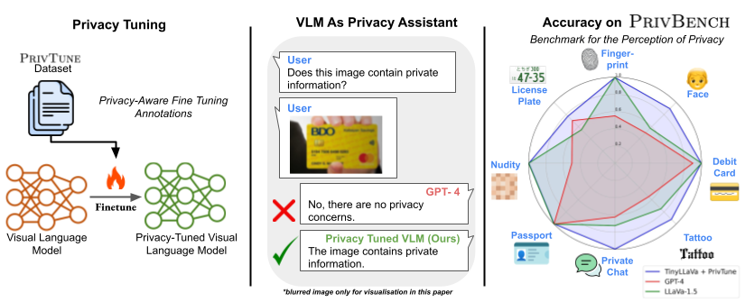

# Privacy-Aware Visual Language Models

Welcome to the repository for our work on Privacy-Aware Visual Language Models. Our research explores how Visual Language Models (VLMs) manage privacy-sensitive content, introducing novel benchmarks and fine-tuning techniques to enhance privacy awareness in these models.

📄 **[Read the Paper](https://arxiv.org/abs/2405.17423)**



[//]: # (# Scores on PrivBench)

[//]: # ()
[//]: # (Below is a table showcasing the performance scores of different models on the PrivBench and PRIVBENCH-Hard benchmarks.)

[//]: # (| **Model**               | **PrivBench F1** | **PrivBench-H F1** |)

[//]: # (|-------------------------|------------------|--------------------|)

[//]: # (| Privacy-Tuned TinyLLaVA | 0.93             | 0.78               | )

[//]: # (| MoeLLaVa                | 0.84             | 0.71               | )

[//]: # (| CoAgent                 | 0.80             | 0.67               | )

[//]: # (| LLaVa                   | 0.79             | 0.69               | )

[//]: # (| CogVLM                  | 0.69             | 0.60               |)

[//]: # (| Zero-Shot TinyLLaVa     | 0.64             | 0.61               |)

[//]: # (| ...                     | ...              | ...                |)
# Scores on PrivBench

Below is a table showcasing the performance scores of different models on the **PrivBench** and **PrivBench-Hard** benchmarks.

<table>
  <thead>
    <tr>
      <th style="background-color:#f0f4f7; border: 1px solid #ccc; padding: 10px; text-align: left;">Model</th>
      <th style="background-color:#f0f4f7; border: 1px solid #ccc; padding: 10px; text-align: center;">PrivBench F1</th>
      <th style="background-color:#f0f4f7; border: 1px solid #ccc; padding: 10px; text-align: center;">PrivBench-H F1</th>
    </tr>
  </thead>
  <tbody>
    <tr>
      <td style="border: 1px solid #ccc; padding: 8px;">Privacy-Tuned TinyLLaVA</td>
      <td style="border: 1px solid #ccc; padding: 8px; text-align: center;">0.93</td>
      <td style="border: 1px solid #ccc; padding: 8px; text-align: center;">0.78</td>
    </tr>
    <tr>
      <td style="border: 1px solid #ccc; padding: 8px;">MoeLLaVa</td>
      <td style="border: 1px solid #ccc; padding: 8px; text-align: center;">0.84</td>
      <td style="border: 1px solid #ccc; padding: 8px; text-align: center;">0.71</td>
    </tr>
    <tr>
      <td style="border: 1px solid #ccc; padding: 8px;">CoAgent</td>
      <td style="border: 1px solid #ccc; padding: 8px; text-align: center;">0.80</td>
      <td style="border: 1px solid #ccc; padding: 8px; text-align: center;">0.67</td>
    </tr>
    <tr>
      <td style="border: 1px solid #ccc; padding: 8px;">LLaVa</td>
      <td style="border: 1px solid #ccc; padding: 8px; text-align: center;">0.79</td>
      <td style="border: 1px solid #ccc; padding: 8px; text-align: center;">0.69</td>
    </tr>
    <tr>
      <td style="border: 1px solid #ccc; padding: 8px;">CogVLM</td>
      <td style="border: 1px solid #ccc; padding: 8px; text-align: center;">0.69</td>
      <td style="border: 1px solid #ccc; padding: 8px; text-align: center;">0.60</td>
    </tr>
    <tr>
      <td style="border: 1px solid #ccc; padding: 8px;">Zero-Shot TinyLLaVa</td>
      <td style="border: 1px solid #ccc; padding: 8px; text-align: center;">0.64</td>
      <td style="border: 1px solid #ccc; padding: 8px; text-align: center;">0.61</td>
    </tr>
    <tr>
      <td style="border: 1px solid #ccc; padding: 8px;">...</td>
      <td style="border: 1px solid #ccc; padding: 8px; text-align: center;">...</td>
      <td style="border: 1px solid #ccc; padding: 8px; text-align: center;">...</td>
    </tr>
  </tbody>
</table>

*Table: Performance scores of various models on PrivBench and PrivBench-H benchmarks.*

# How to Run the Code

To replicate our experiments, follow the steps below. Replace the placeholder commands with your specific code as needed.

```bash
# Clone the repository
git clone https://github.com/laurenssam/Privacy-Aware-Visual-Language-Models.git
cd Privacy-Aware-Visual-Language-Models

# Install dependencies
pip install -r requirements.txt

# Evaluate the model on PRIVBENCH
python run_privacy_analysis_experiment.py --model_name tinyllava --dataset privbench

# Evaluate the model on PRIVBENCH
python run_privacy_analysis_experiment.py --model_name tinyllava --dataset privbench_hard
```
 
# Request Access to PrivBech, PrivBench-H & PrivTune
Due to the sensitive nature of the images in our dataset, access is restricted to researchers for specific research purposes. To request access, please fill out the [dataset access form](https://forms.gle/j4X7KUgL6nxwoBeR8).

# Citation
If you use our work in your research, please cite it as follows:
@article{samson2024privacy,
  title={Privacy-Aware Visual Language Models},
  author={Samson, Laurens and Barazani, Nimrod and Ghebreab, Sennay and Asano, Yuki M},
  journal={arXiv preprint arXiv:2405.17423},
  year={2024}
}


