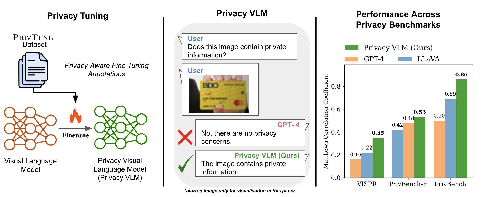

# Privacy-Aware Visual Language Models

[](https://arxiv.org/abs/2405.17423)

Welcome to the repository for our work on Privacy-Aware Visual Language Models. Our research explores how Visual Language Models (VLMs) manage privacy-sensitive content, introducing novel benchmarks and fine-tuning techniques to enhance privacy awareness in these models.



# Scores on Privacy datasets

| Model | PrivBench | PrivBench-H |  VISPR   |
|-------|:---------:|:-----------:|:--------:|
| **Privacy VLM (InternVL2.5-4B)** | **0.90**  |    0.51     | **0.39** |
| **Privacy VLM (TinyLLaVA)** |   0.86    |  **0.53**   |   0.35   |
| **Privacy VLM (InternVL2.5-2B)** |   0.65    |    0.36     |   0.25   |
| MoELLaVA |   0.72    |    0.40     |   0.16   |
| InternVL2.5-4B |   0.69    |    0.46     |   0.24   |
| LLaVA |   0.69    |    0.42     |   0.22   |
| ShareGPT4V |   0.67    |    0.47     |   0.23   |
| CogVLM |   0.65    |    0.33     |   0.18   |
| CoAgent |   0.62    |    0.25     |   0.27   |
| TinyLLaVA |   0.60    |    0.43     |   0.19   |
| GPT-4 |   0.50    |    0.48     |   0.16   |
| InternVL2.5-4B |   0.39    |    0.22     |   0.10   |


*Matthews Correlation Coefficient (MCC). Privacy VLMs trained on PrivTune.*

# How to Run the Code

```bash
git clone https://github.com/laurenssam/Privacy-Aware-Visual-Language-Models.git
cd Privacy-Aware-Visual-Language-Models
pip install -r requirements.txt

python scripts/run_privacy_analysis_experiment.py \
    --model_name tinyllava \
    --dataset_name privbench \
    --dataset_path /path/to/privbench
```

# Request Access to PrivBench & PrivTune
Due to the sensitive nature of the images in our dataset, access is restricted to researchers for specific research purposes. To request access, please fill out the [dataset access form](https://forms.gle/j4X7KUgL6nxwoBeR8).

# Benchmark Your Own Model on PrivBench

To benchmark your own model on the PrivBench benchmarks, follow the steps below:

1. **Add Your Model to the Models Folder**  
   Place your model script in the `models` folder. Use the provided template `your_model.py` as a reference.

2. **Update the `init_model.py`**  
   Add an entry for your model in the `init_model.py` file to ensure it is recognized by the benchmarking script.

3. **Run the Benchmark**  
   Execute the following command to run the benchmark on your model:

   ```bash
   python scripts/run_privacy_analysis_experiment.py --model_name your_model --dataset_name privbench --dataset_path /path/to/privbench
   ```

# Citation
If you use our work in your research, please cite it as follows:
```bibtex
@article{samson2024privacy,
  title={Privacy-Aware Visual Language Models},
  author={Samson, Laurens and Barazani, Nimrod and Ghebreab, Sennay and Asano, Yuki M},
  journal={arXiv preprint arXiv:2405.17423},
  year={2024}
}
```
